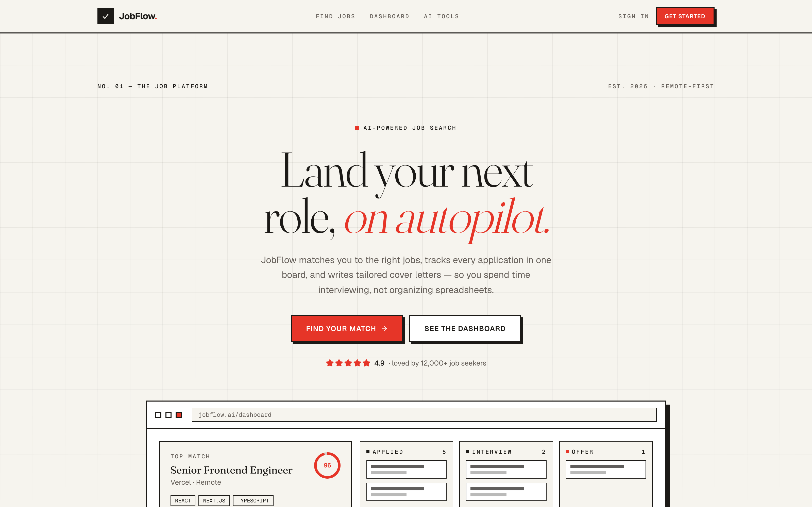
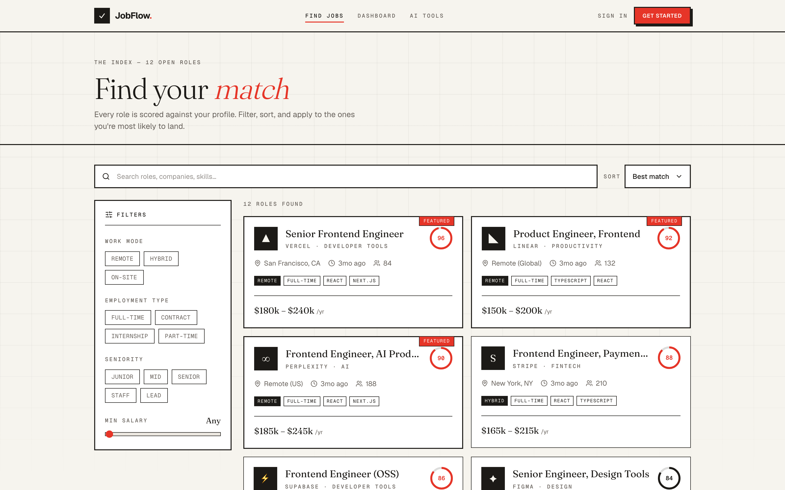
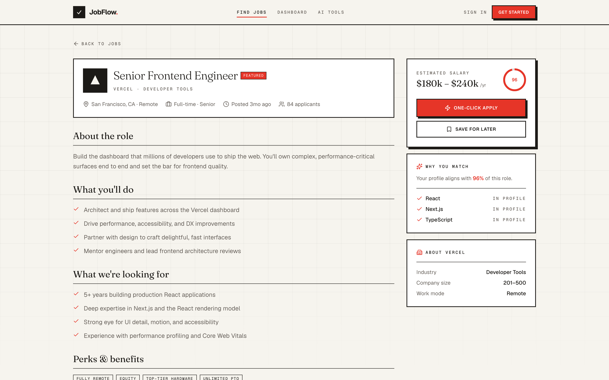
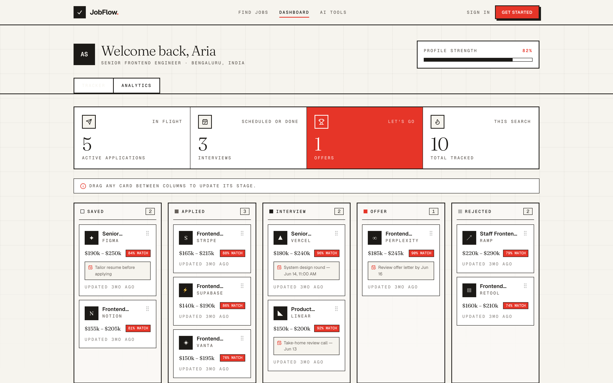
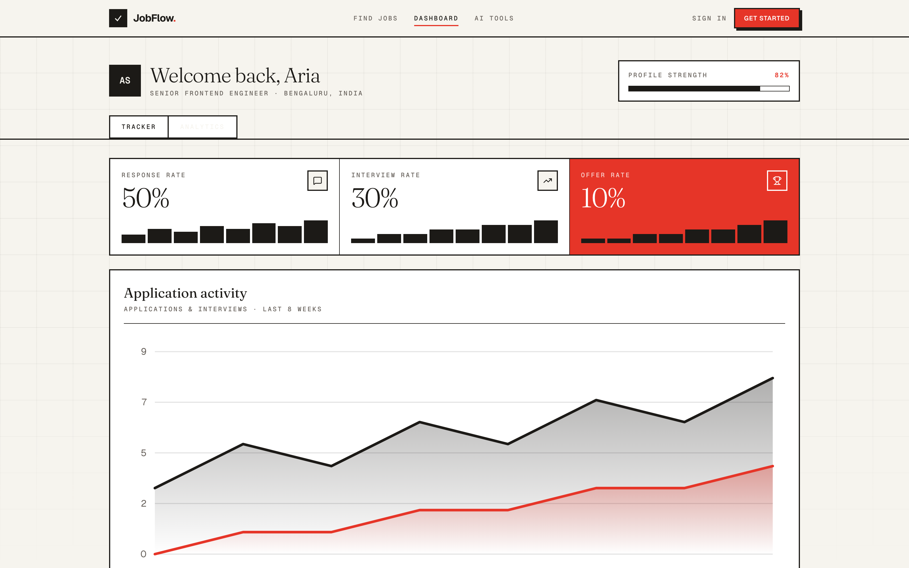
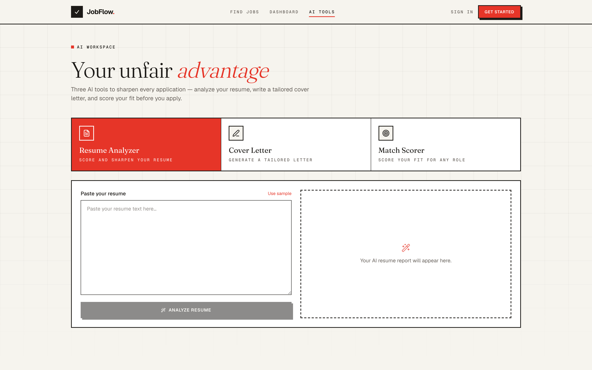
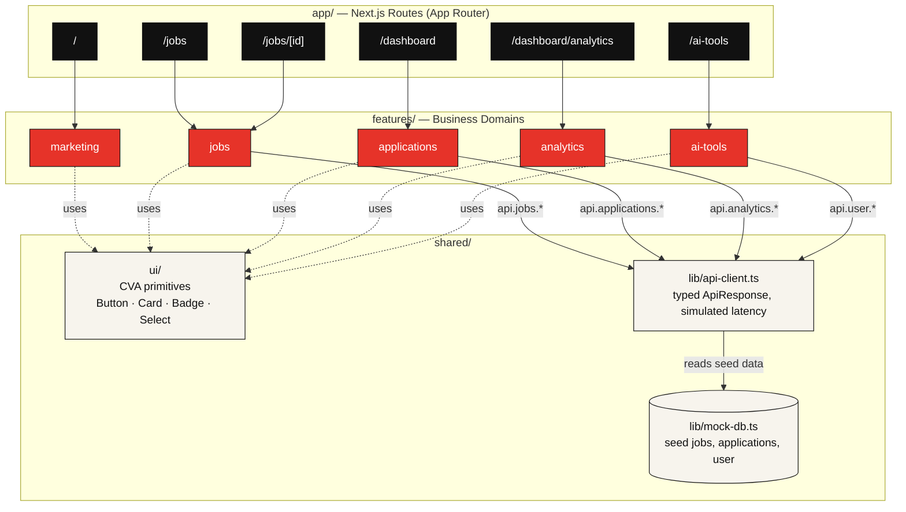

<h1 align="center">JobFlow AI</h1>

<p align="center">
  <strong>Land your next role, on autopilot.</strong>
</p>

<p align="center">
  An intelligent job platform — AI-matched roles, a drag-and-drop application tracker,<br/>
  and AI tools that write your cover letters — in an editorial-luxe, neo-brutalist UI.
</p>

<p align="center">
  
  
  
  
  
</p>

<p align="center">
  <a href="#product-tour">Product Tour</a> •
  <a href="#architecture">Architecture</a> •
  <a href="#design-system">Design System</a> •
  <a href="#folder-structure">Folder Structure</a> •
  <a href="#run-locally">Run locally</a> •
  <a href="#tech-stack">Tech Stack</a>
</p>

---

JobFlow AI matches job seekers to roles by AI fit score, tracks every application on a Kanban board across five stages, and ships three AI tools — resume analyzer, cover-letter generator, match scorer — that sharpen an application before it goes out. Every screen is a fully working, statically-typed frontend built on Next.js 16's App Router, driven by a single mock API layer designed to be swapped for a real backend in one file.

## Product Tour

### Landing — AI-matched pitch, live product preview

<p align="center">
  
</p>

### Find Jobs — search, multi-facet filters, AI match scores

<p align="center">
  
</p>

### Job Detail — full breakdown, "why you match", one-click apply

<p align="center">
  
</p>

### Tracker — drag-and-drop Kanban across 5 stages

<p align="center">
  
</p>

### Analytics — dependency-free SVG charts

<p align="center">
  
</p>

### AI Tools — resume analyzer, cover letter generator, match scorer

<p align="center">
  
</p>

## Architecture



**Reading the diagram:** solid arrows are runtime data calls (a feature's hook calling into the API client, the API client reading the mock DB); dotted arrows are compile-time UI composition (a feature rendering shared primitives). Nothing ever calls "up" or sideways across features — data and UI both flow one direction, top to bottom.

1. **Routes** (`app/`) are thin — they compose feature components and own Next.js concerns only: `generateStaticParams`, `generateMetadata`, async `params`, loading/error boundaries.
2. **Features** (`features/*`) own a business domain end to end: components, hooks, and (for `ai-tools`) a simulation lib. Each exposes a single public `index.ts` barrel; features never import from another feature.
3. **The API client** (`shared/lib/api-client.ts`) is the only thing any hook talks to. It filters/sorts/paginates the mock DB, wraps results in a typed `ApiResponse<T>` envelope, and adds artificial latency so loading skeletons are exercised — the same shape a real REST/GraphQL client would return.
4. **Shared UI** (`shared/ui/*`) is a small set of `class-variance-authority`–driven primitives that every feature composes, keeping the neo-brutalist look (sharp corners, hard borders, offset shadows) consistent everywhere.

## Design System

JobFlow doesn't use a typical dark SaaS palette — it's **"Editorial Luxe / Neo-Brutalist"**: warm paper background, near-black ink, a single vermillion accent, hard 1px borders, offset drop-shadows, and zero border-radius everywhere.

| Token | Value | Role |
| --- | --- | --- |
| `--background` | `#F7F4ED` warm paper | Page background |
| `--foreground` | near-black ink | Body text, borders |
| `--accent` | `#E63329` vermillion | The one accent color — CTAs, scores, highlights |
| `--radius` | `0rem` | Sharp corners everywhere, no rounding |

All tokens are raw HSL channels defined once on `:root` in `src/app/globals.css` and consumed by Tailwind v4 via `@theme inline` — re-theming the entire app is a matter of swapping variable values, not hunting through component files.

## Folder Structure

Feature-based structure with strict boundaries (`features/` → `shared/`, never feature → feature):

```
jobflow-ai/
├── src/
│   ├── app/                       # Routes only (App Router)
│   │   ├── page.tsx                 # / — marketing landing
│   │   ├── jobs/
│   │   │   ├── page.tsx              # /jobs — board
│   │   │   └── [id]/
│   │   │       ├── page.tsx           # /jobs/[id] — detail, generateStaticParams
│   │   │       └── loading.tsx
│   │   ├── dashboard/
│   │   │   ├── layout.tsx            # shared tracker/analytics sub-nav
│   │   │   ├── page.tsx              # /dashboard — Kanban tracker
│   │   │   └── analytics/page.tsx    # /dashboard/analytics
│   │   └── ai-tools/page.tsx        # /ai-tools — AI workspace
│   │
│   ├── features/                  # Business domains, each with a public index.ts
│   │   ├── marketing/                # hero, features, stats, testimonials, CTA
│   │   ├── jobs/                     # board, card, filters, detail, useJobs
│   │   ├── applications/             # Kanban board, stat cards, useApplications
│   │   ├── analytics/                # SVG chart primitives + analytics view
│   │   └── ai-tools/                 # resume / cover-letter / match tools + simulate lib
│   │
│   ├── shared/
│   │   ├── ui/                       # CVA-based primitives (Button, Badge, Card, Select…)
│   │   ├── layout/                   # Navbar, Footer, BackgroundFX, SubNav
│   │   ├── lib/                      # api-client (mock) + mock-db
│   │   ├── hooks/                    # useDebouncedValue
│   │   ├── types/                    # cross-cutting domain entities
│   │   └── utils/                    # cn(), formatters
│   │
│   └── config/                    # site + navigation config
│
├── public/                        # static assets
└── docs/assets/                   # README screenshots
```

**Key decisions**
- **Centralized data layer** — components never fetch directly. Feature hooks call a single mock `api` client (`shared/lib/api-client.ts`) with simulated latency, typed responses, and an `ApiResponse<T>` envelope. Swapping in a real backend is a one-file change.
- **Design tokens as CSS variables** — semantic colors (each paired with a `-foreground`) defined as HSL channels on `:root`, consumed by Tailwind v4 via `@theme inline`.
- **CVA variants** for type-safe component APIs that extend native HTML attributes.
- **Custom SVG charts** — no charting dependency; full control over the editorial aesthetic and animation.

## Run locally

```bash
npm install
npm run dev      # http://localhost:3000
```

```bash
npm run build    # production build
npm run start    # serve the production build
npm run lint      # eslint
```

No environment variables or backend are required — all data is served by the in-memory mock API (`src/shared/lib/mock-db.ts`), with simulated network latency so every loading state (skeletons, disabled buttons, optimistic UI) is real and visible.

## Tech Stack

| Layer | Technology |
| --- | --- |
| Framework | Next.js 16 (App Router), React 19, TypeScript 5 |
| Styling | Tailwind CSS v4 — zero config file, tokens via `@theme inline` |
| Animation | `motion` (Framer Motion) |
| Components | `class-variance-authority` + `tailwind-merge` |
| Icons | `lucide-react` |
| Data | Mocked in-memory API with a typed client and simulated latency |

## What's Inside

| Route | Description |
| --- | --- |
| `/` | Marketing landing — animated hero with product preview, feature grid, animated stat counters, how-it-works, testimonials, CTA |
| `/jobs` | Job board — live debounced search, multi-facet filters, sort, animated grid, AI match scores, loading skeletons & empty state |
| `/jobs/[id]` | Job detail — full role breakdown, "why you match" AI panel, one-click apply (optimistic), similar roles. Statically prerendered via `generateStaticParams` |
| `/dashboard` | Application tracker — drag-and-drop Kanban across 5 stages with live stat cards |
| `/dashboard/analytics` | Analytics — custom dependency-free SVG charts (animated area, donut, funnel) with hover readouts |
| `/ai-tools` | AI workspace — resume analyzer (scored), cover-letter generator (typewriter), and match scorer |
