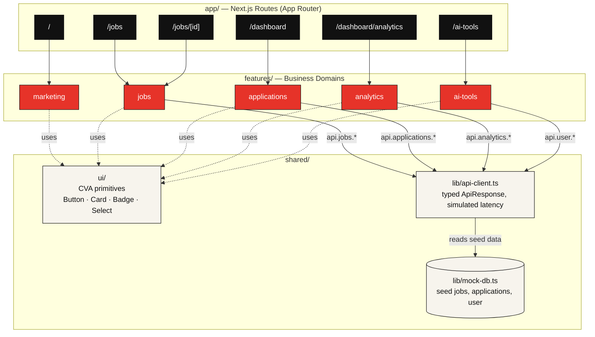

# Architecture

JobFlow AI is a fully client-rendered, statically-typed frontend with **no
external backend**. Every route ultimately reads from one in-memory mock data
layer, structured to swap for a real API in a single file.

## Data flow

**Reading the diagram:** solid arrows are runtime data calls (a feature's hook
calling into the API client, the API client reading the mock DB); dotted
arrows are compile-time UI composition (a feature rendering shared
primitives). Nothing ever calls "up" or sideways across features — data and
UI both flow one direction, top to bottom.

## Layers

1. **Routes** (`app/`) are thin — they compose feature components and own
   Next.js concerns only: `generateStaticParams`, `generateMetadata`, async
   `params`, loading/error boundaries.
2. **Features** (`features/*`) own a business domain end to end: components,
   hooks, and (for `ai-tools`) a simulation lib. Each exposes a single public
   `index.ts` barrel; features never import from another feature.
3. **The API client** (`shared/lib/api-client.ts`) is the only thing any hook
   talks to. It filters/sorts/paginates the mock DB, wraps results in a typed
   `ApiResponse<T>` envelope, and adds artificial latency so loading skeletons
   are exercised — the same shape a real REST/GraphQL client would return.
4. **Shared UI** (`shared/ui/*`) is a small set of `class-variance-authority`–
   driven primitives that every feature composes, keeping the neo-brutalist
   look (sharp corners, hard borders, offset shadows) consistent everywhere.

See [`folder-structure.md`](./folder-structure.md) for the full directory
layout and [`design-system.md`](./design-system.md) for the visual language
these layers render with.
